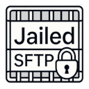

# Home Assistant Add-on: Jailed SFTP

This repository contains the **Jailed SFTP** add-on for Home Assistant.

## About

The Jailed SFTP add-on provides a secure sftp server that allows you to create multiple users, each restricted to a specific directory (chroot jail) within your `media` or `share` folders.

## Installation

1. Go to the Add-on Store → Click the **More** button (⋮) in the upper-right corner → Select **Repositories**  
2. Paste the following URL:
   [https://github.com/modestpharaoh/hassio-jailed-sftp-addon](https://github.com/modestpharaoh/hassio-jailed-sftp-addon)
3. Or, simply click the button below to add it automatically:

## License

All add-ons in this repository are released under the [MIT License](./LICENSE).